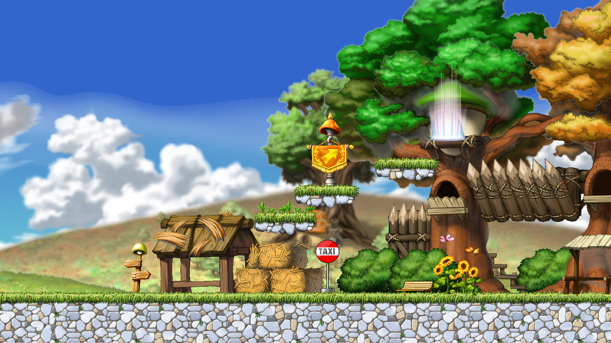

# maple-moon



A from-scratch game client for MapleStory. Built with [MoonBit](https://www.moonbitlang.com/) and [Selene](https://github.com/kkkiio/selene), a small 2D game engine.

Reimplementing every feature of the original game is not a goal.

## Installation

```bash
git clone <repo-url>
cd maple-moon
npm install
```

Requires [Node.js](https://nodejs.org/) and [MoonBit](https://www.moonbitlang.com/download/).

## Usage

### Play in browser

```bash
just build
just run-web
```

`just run-web` starts Vite and serves the normal `game_web` entry at
http://localhost:8080. Run `just build` again after changing MoonBit source.

For CLI-driven development and long-running agent tasks, use:

```bash
just dev
```

`just dev` watches the `game_debug` build, starts Vite, and opens a controlled
Chrome at http://localhost:8080/game_debug.html. Browser Console output is
streamed to the terminal and written to `logs/browser.log`. The command owns a
foreground `mapled` session; an older daemon is closed before the session
starts.

Closing the controlled Chrome pauses log collection while Vite and `mapled`
keep running. Run the following command from another terminal to explicitly
open Chrome again:

```bash
moon run --target native src/cmd/maple open
```

Press `Ctrl+C` in the `just dev` terminal to stop the development session.

### Build native executable

```bash
just build-native
```

Produces an executable with the `assets/` directory alongside it. Place both in the same folder and run the executable.

The runtime directory must contain `assets/base/`. Optional DLC and patch packs
are additional siblings under `assets/`; each pack uses the same internal
layout. `source_assets/` contains editable project sources and is not part of a
player distribution.
