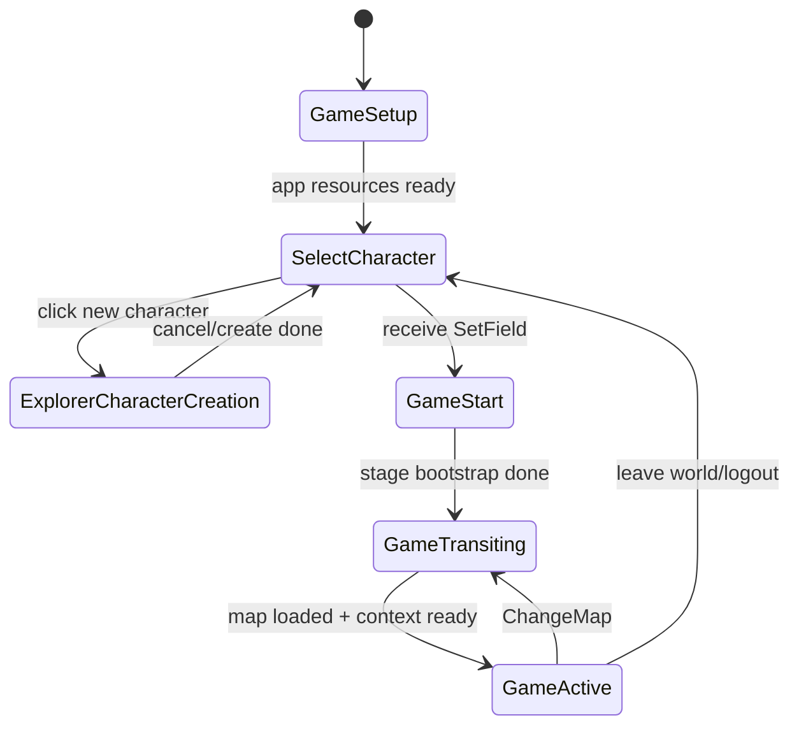

# game_state

`game_state` 包负责定义并管理游戏流程阶段（`GamePhase`）及其切换约束。

## GamePhase State Machine

`GamePhase` 仅表达流程阶段（phase），不承载可变加载句柄。
异步加载状态（`Future`）放在对应模块的 runtime `Ref` 中。
状态切换统一通过 `set_next_phase(...)` 发起。

与实现约束对齐：

- 持续系统使用 `run_if(in_phase(...))`。
- 一次性生命周期动作使用 `OnEnter/OnExit`。
- 需要“带原因”的切换判断时使用 `transition(from,to)`。
